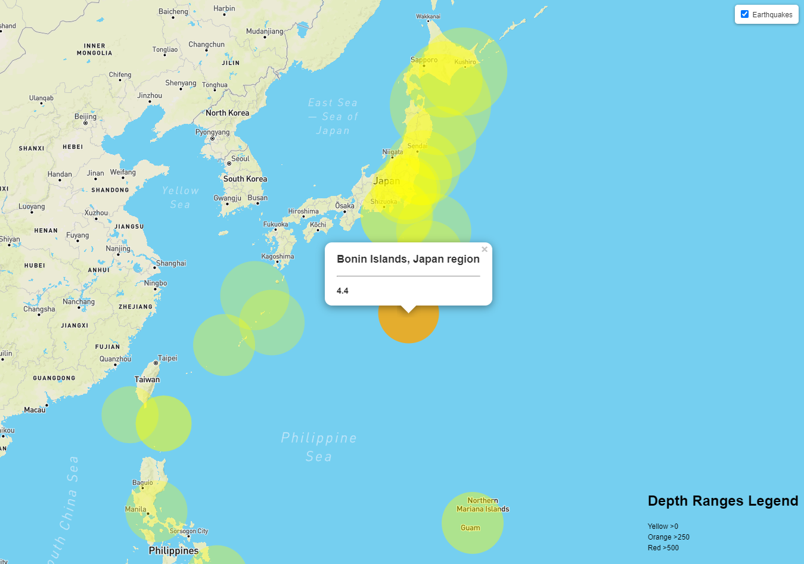

# Leaflet-Mapping_Earthquake_Locations_and_Intesity
This script utilizes Leaflet to plot all of the earthquakes within the past 7 days. The dataset is a GeoJSON that comes from the [United States Geological Survey](http://earthquake.usgs.gov/earthquakes/feed/v1.0/geojson.php) (USGS). The location of each earthquakes marker is determined by its longitude and latitude. The size of the marker reflects its magnitude, while the depth for the earthquake is expressed by its color. Earthquakes with higher magnitudes appear larger and earthquakes with greater depth appear darker in color. Each marker is accompanied by a popup that provides additional information about the earthquake when the marker is clicked. A legend has also been added to the map to provide context for the visualization.
- - -
### Tech Stack
* JavaScript
* CSS
* HTML

### User Instructions
* Clone the repository: git clone https://github.com/DarrylB32/Leaflet-Mapping_Earthquake_Locations_and_Intesity.git 
*  In command: python -m http.server 
*  In web browser: http://localhost:8000/

 
### Additional Notes
Updates will be made to provide a larger color spectrum to reflect the depth of the earthquake along with making the opacity of the markers static and solid. The legend will be given its own background and reformatted for easier readability and presentation. 

Lastly, additional data will be added to the map that will be selected via layer controls.
